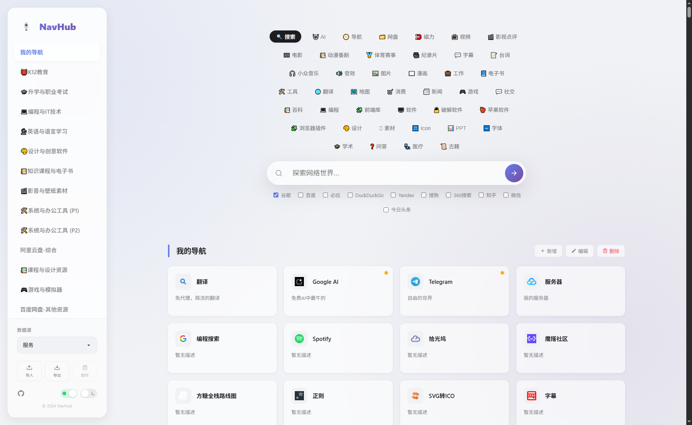
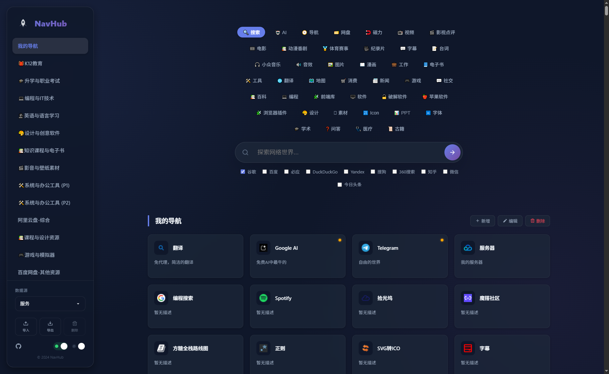

# 纯前端静态导航页

一个轻量、优雅且功能强大的纯前端个人导航/起始页。它采用现代原生 JavaScript (ES6 Modules) 构建，无需后端数据库，部署简单，即开即用。

它不仅是一个浏览器主页，更是一个强大的书签管理工具，支持聚合搜索、从浏览器书签导入数据、多数据源切换以及高度的个性化配置。

## ✨ 核心特性

*   **⚡️ 纯静态 & 零依赖**：基于原生 HTML/CSS/JS，无 Node.js 构建过程，无后端数据库，可部署在 GitHub Pages、Vercel 或任何静态服务器。
*   **📱 响应式设计**：
    *   桌面端：悬浮侧边栏，毛玻璃特效。
    *   移动端：侧边栏自动收纳为抽屉菜单，顶部导航栏自动适配。
*   **🎨 个性化主题**：
    *   **深色/浅色模式**：支持手动切换，亦可跟随系统自动切换。
    *   **动态背景**：内置微妙的动态光晕背景效果。
*   **🌍 代理模式开关**：
    *   一键切换“全球/本地”模式。开启时显示需要代理访问的资源（如 Google、YouTube），关闭时自动隐藏这些卡片，保持界面清爽。
*   **🔍 增强型聚合搜索**：
    *   **多引擎并发**：支持在同一类别下勾选多个搜索引擎，一次回车，同时打开多个搜索结果页。
    *   **搜索建议**：集成百度 Suggestion API，提供实时搜索联想。
    *   **自定义配置**：通过 JSON 配置文件轻松管理搜索分类和引擎。
*   **💾 强大的数据管理**：
    *   **导入功能**：支持导入 **Chrome/Edge 书签文件 (.html)** 或 NavHub 专用 **JSON 数据包**。支持“作为新数据源”或“合并到我的导航”。
    *   **导出功能**：将当前配置和数据一键导出为 JSON 文件备份。
    *   **多数据源**：内置多个精选资源库，同时支持用户添加自定义数据源。
    *   **本地持久化**：所有自定义数据、排序、主题偏好均存储在浏览器 `LocalStorage` 中。
*   **✏️ 可视化编辑**：
    *   **所见即所得**：在“我的导航”分类下，通过弹窗轻松新增、编辑网站信息。
    *   **拖拽排序**：支持拖拽卡片调整顺序。
    *   **批量管理**：独立的编辑模式和删除模式，操作更安全便捷。

## 📸 截图

**主界面 (浅色/深色模式)**
<p align="center">
  
  
</p>

## 📂 项目结构

项目代码结构清晰，易于维护：

```text
NavHub/
├── index.html          # 入口文件
├── style.css           # 核心样式表 (包含 CSS 变量定义)
├── favicon.svg         # 网站图标
├── js/                 # 核心逻辑 (ES6 Modules)
│   ├── main.js         # 入口脚本，事件协调
│   ├── dataManager.js  # 数据状态管理、LocalStorage 读写
│   ├── ui.js           # DOM 操作、渲染、模态框控制
│   ├── fileManager.js  # 导入/导出、文件解析逻辑
│   └── icons.js        # SVG 图标库
└── data/               # 配置文件目录
    ├── 00engines.json  # 搜索引擎与搜索分类配置
    ├── 01资源.json      # 内置数据源示例 1
    └── 02服务.json      # 内置数据源示例 2 (默认加载)
```

## 🚀 快速开始

### 1. 获取代码
将本项目下载或克隆到本地。

### 2. 本地运行
直接使用浏览器打开 `index.html` 即可开始使用。

### 3. 功能使用指南

*   **切换数据源**：点击侧边栏底部的“数据源”下拉菜单，可以在内置源（如“资源”、“服务”）和用户导入的自定义源之间切换。
*   **导入书签**：
    1.  点击侧边栏底部的 **导入 (Upload)** 按钮。
    2.  选择浏览器的导出的 `bookmarks.html` 文件或之前备份的 `.json` 文件。
    3.  选择 **“作为新的数据源”**（创建独立视图）或 **“全部添加到当前‘我的导航’分类”**。
*   **开启/关闭代理资源**：点击侧边栏底部的 **地球/盾牌** 图标。开启（绿色地球）时显示海外资源，关闭（盾牌）时隐藏。
*   **管理网站**：
    *   **新增**：点击分类标题右侧的 `+ 新增` 按钮。
    *   **编辑/排序**：点击侧边栏底部的 **编辑** 按钮，卡片进入编辑模式，可点击卡片修改信息，或拖拽卡片排序。
    *   **删除**：点击侧边栏底部的 **删除** 按钮，点击卡片右上角的红色删除图标即可移除。

### 4. 配置文件说明

你可以直接修改 `data/` 目录下的 JSON 文件来定制初始数据：

*   **`data/00engines.json`**:
    *   `categories`: 定义搜索栏上方的分类 Tabs。
    *   `engines`: 定义每个分类下的搜索引擎列表。URL 中的 `%s` 会被替换为搜索词。
*   **`data/xx.json` (资源文件)**:
    *   结构包含 `categories` 数组。
    *   每个 `site` 对象包含 `title` (标题), `url` (链接), `icon` (图标链接), `desc` (描述), `proxy` (布尔值, true表示需代理)。

## 🔧 部署

由于是纯静态项目，你可以将其部署到任何静态托管服务：

*   **GitHub Pages**: Push 代码到仓库，在 Settings -> Pages 中开启。
*   **Vercel / Netlify**: 关联 GitHub 仓库即可自动部署。
*   **Nginx / Apache**: 将根目录指向项目文件夹。

### Actions
1. **配置仓库设置**:
    *   进入您的 GitHub 仓库页面。
    *   点击 **Settings** (设置)。
    *   在左侧菜单中，选择 **Pages**。
    *   在 "Build and deployment" (构建和部署) 部分，将 Source (源) 从 "Deploy from a branch" (从分支部署) **更改为 "GitHub Actions"**。
2. **查看部署**:
    *   完成以上步骤后，每次向 `main` 分支推送代码，GitHub Actions 都会自动运行。
    *   您可以在仓库的 **Actions** 标签页中查看工作流的运行状态。
    *   第一次成功运行后，您的 NavHub 网站就会部署成功。您可以在 **Settings -> Pages** 页面找到您的网站访问链接，通常格式为 `https://<your-username>.github.io/NavHub/` 例如：[git-hub-cc](https://git-hub-cc.github.io/NavHub/)。
## 🤝 致谢与资源

本项目在开发过程中参考或使用了以下资源，特此致谢：

*   **设计灵感**: [onenav](https://github.com/helloxz/onenav)
*   **图标资源**: SVG Icons (Inlined in code)
*   **数据来源**:
    *   [学习资源船舱](https://link3.cc/studyship)
    *   [大数据导航](https://hao.199it.com)
    *   哆啦A梦的神奇口袋、小帅同学、懒人找资源、薛信的资料室、阿虚同学、陈蛋蛋的宝藏库、鱼果天晴的资源库等。

## 📄 许可证

该项目采用 [MIT](./LICENSE) 许可证。